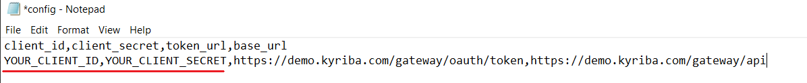

# Import ERP Payments
Repository containing samples and files for Importing ERP Payments

## Requirements

Opening .ipynb files requires:
1. Google account
2. [Google Colaboratory][1]

[1]: https://workspace.google.com/marketplace/app/colaboratory/1014160490159?pann=ogb


## Installation

1.  Copy the repository link, open Command Prompt, go to the location where file will be copied and execute git clone command:

```shell
git clone https://github.com/kyriba/Imperial-Hackathon.git
```
2. Make sure you are on the right branch, by executing this command:

```shell
git checkout import-erp-payment
```

3. Import import-ERP-payment.ipynb file into your Google Drive.

4. Open config.csv file and input your client credentials by replacing the highlighted items with your client_id and client_secret, separated by the coma. Config file should look like this:



5. Open the jupyter notebook with Google Collab.

6. In the Table of Content on the left, click on the folder logo  which opens Files section, find 'content' folder and upload config.csv file into this folder.

7. Run the application. You can run the whole application: Runtime -> Run all, or execute separated cells.

> ⚠️  _Please notice that Python is a script language and the code will be executed row by row or in the order you will run the cells._

